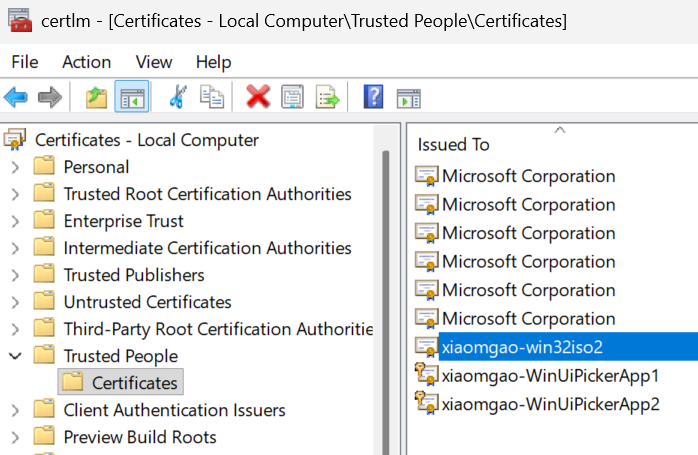
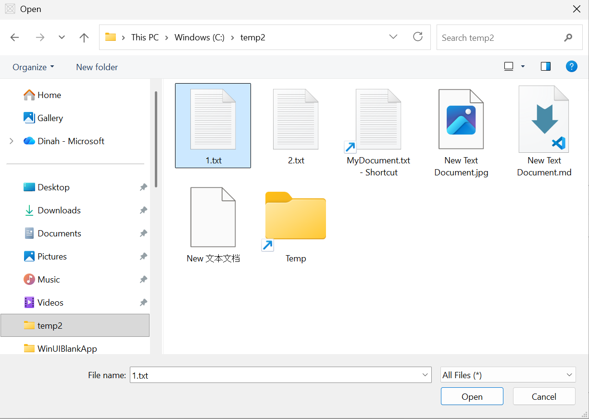
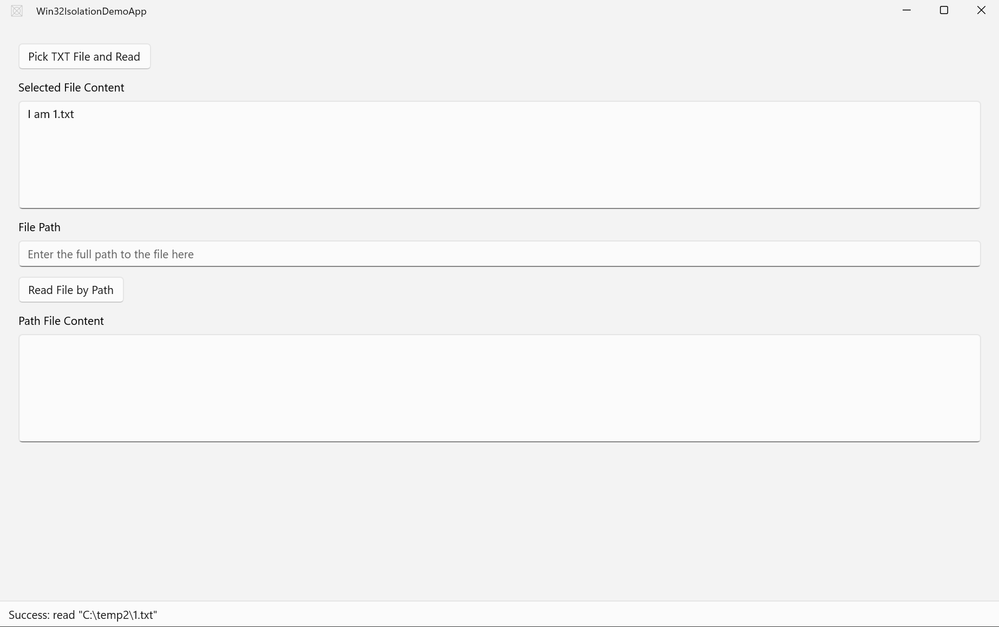
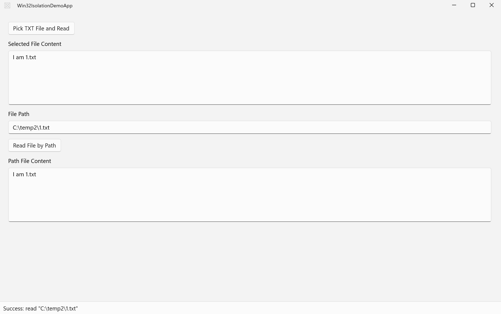
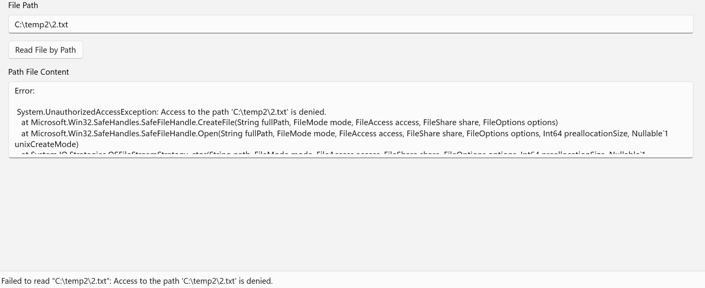

This app shows how to enable the win32-isolation in single packaged WinUI app and demos its effects.

1. Reference:
[Packaging a Win32 app isolation application with Visual Studio - Win32 apps | Microsoft Learn](https://learn.microsoft.com/en-us/windows/win32/secauthz/app-isolation-packaging-with-vs)

2. To test this app locally, follow the steps to publish app package in above doc, from step 5:

Note: after you have followed the dot to create your own certificate, install it in the `certlm.msc` 
(Press Win+R) and input certlm.msc to open it), under `Trusted People` certificates.

3. test the win32-isolation.

3.1 prepare 2 txt files on your machine, for instance, 1.txt and 2.txt, with different contents.

3.2 click the first button to choose 1.txt, the app will read it.

3.4 now set the path of 1.txt for the second button, click, the app will read it too.

3.5 now change the path to 2.txt, click button, notice that the app cannot read a file that is not picked by the user yet.

3.6 2.txt cannot be read by the app until you use the first button to pick it. 
That's win32-app-isolation's working.